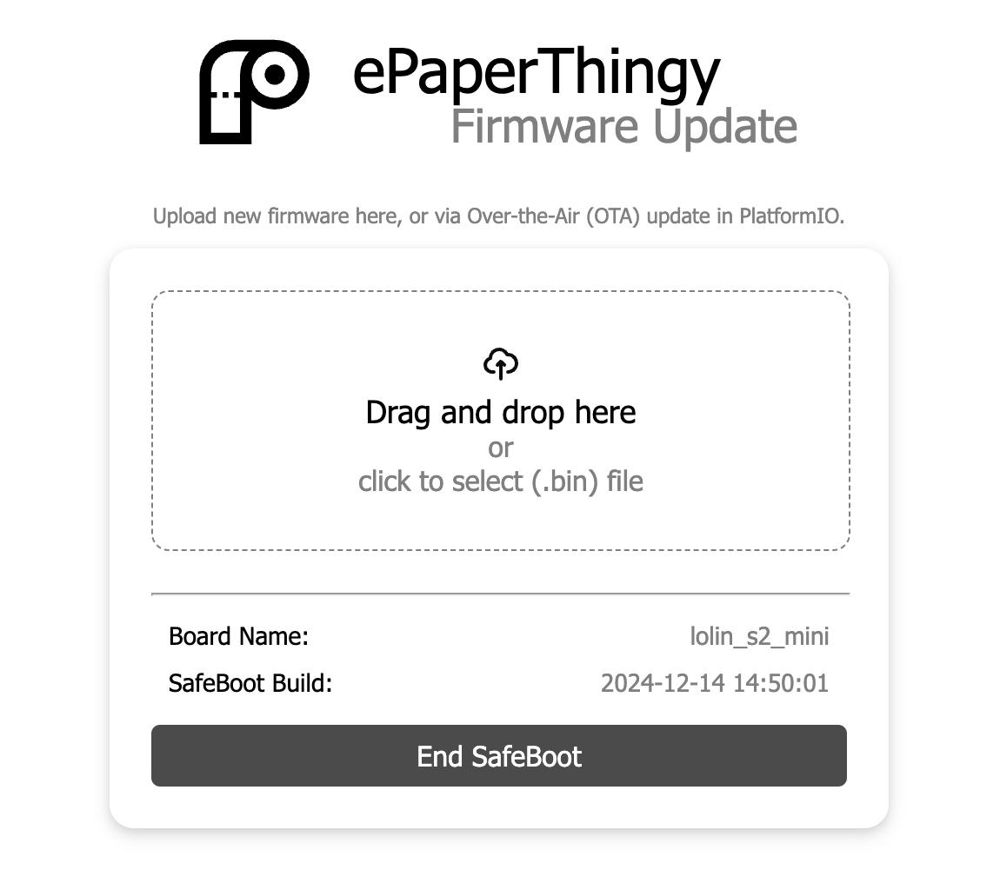

# ePaper Panel

Simple test program for a [Waveshare Tri-Color 1.54 Inch E-Ink Display Module](https://www.waveshare.com/1.54inch-e-paper-module-b.htm) connected to a [Wemos S2 mini board](https://www.wemos.cc/en/latest/s2/s2_mini.html) (ESP32-S2 based with USB-CDC).

## Why do I need it?

Actually, I would love to implement this using [ESPHome](https://esphome.io/) to easily embedd it into my [HomeAssistant](https://www.home-assistant.io/)-instance, but support for E-Ink displays is rather limited. Note, never buy before reading...

## How is it made?

This project is implemented using [PlatformIO](https://platformio.org/) with the arduino-3 platform from the (p)eople (i)nitiated (o)ptimized (arduino) ([pioarduino](https://github.com/pioarduino/platform-espressif32/)). For my convenience, OTA-programming is enabled by including the [ArduinoOTA](https://github.com/espressif/arduino-esp32)-library from Espressif Systems' Arduino ESP32 project.
Firmware updates and ArduinoOTA is enabled with a small safeboot partition (640KB). The main app can span over ~3MB. To trigger a restart into this partion, just call /safeboot. After a few seconds the OTA-Website shows up:

A little quirky, but the safeboot-partition is tapping the preferences of the main app to connect to your WiFi, or will create a softAP (in this case you might even upload new firmware from the captive portal after connecting to it - tested only on mac though).
When using Over-the-Air (OTA) updating from PlatformIO, the safeboot-mode will be activated via a script when you hit Upload (see `extra_scripts = tools/safeboot_activate.py`).  

* The webserver is powered by [ESPAsyncWebServer](https://github.com/mathieucarbou/ESPAsyncWebServer) - GNU Lesser General Public License v3.0
* The network manager is [MycilaESPConnect](https://github.com/mathieucarbou/MycilaESPConnect) - GNU General Public License v3.0
* The task manager is [TaskScheduler](https://github.com/arkhipenko/TaskScheduler) - BSD 3-Clause "New" or "Revised" License
* The library to control the E-Ink display is [GxEPD2](https://github.com/ZinggJM/GxEPD2) - GNU General Public License v3.0
* The safeboot-partition contains ArduinoOTA and OTA-Update - the scripts factory.py and safeboot.py from [MycilaSafeBoot](https://github.com/mathieucarbou/MycilaSafeBoot) fall under MIT license. [ArduinoOTA](https://github.com/espressif/arduino-esp32/tree/master/libraries/ArduinoOTA) and [Update](https://github.com/espressif/arduino-esp32/tree/master/libraries/Update) are from [Espressif Systems' Arduino ESP32 core library](https://github.com/espressif/arduino-esp32/tree/master/libraries). Both are Apache-2.0
* The icons from the [Mono Interface Icons Collection](https://www.svgrepo.com/collection/mono-interface-icons/) are public domain

## How does it work?

After connecting a display to your board, compile the project, flash it to your board. Connect to the new Access-Point (ePaperPortal) and connect the board to your home WiFi. Afterward you can just open http://epaperthingy.local to see the "minimalistic" Website.
__Future Reference:__ Test pictures are shown on the display when opening http://epaper.local/showpic1 .. http://epaper.local/showpic5 and the display is wiped clean on http://epaper.local/wipe.

### How to flash the firmware?

Flashing the board for the first time is done via esptool within PlatformIO to the USB-CDC of the Wemos S2 mini board. Remember, when using a factory-new board with USB-CDC, you need to press both buttons, release the "0"-button first, then the "RST"-button (this sequence will enable the USB-CDC). Subsequently, you can just flash it without button juggling or simply flash it OTA (set upload_protocol = espota and upload_port = epaper.local in your platformio.ini). When flashing the factory.bin you'll always have to to the button juggling.

## What can I do with it?

That's up to you! Implement your idea on how to use this project to get something interesting done. For me, it's a template to implment a small button with a display that's indicating the state of my smartlock and will open/close it with a push of a button (as I'm too lazy to rotate the knob myself). This relies on my HomeAssistant instance...

## How can I modify it to be of real use?

Just fork the git!
Some points that I would have liked to know earlier:

* The favicon was prepared using [Favicon generator. For real](https://realfavicongenerator.net/). The icon that I use is from the [Pictogrammers' Material Design Icon Libray](https://pictogrammers.com/library/mdi/) and was designed by [Simran](https://pictogrammers.com/contributor/Simran-B/).
* See the `WebsiteTask.cpp` on how to serve the images.
* The favicon-images are taken from the data-folder, compressed and linked into the firmaware image. When you want to find out how to use them, have a look in the firmware.map (in `.pio/build/[your-env]`).
* This project is using [TaskScheduler](https://github.com/arkhipenko/TaskScheduler) for cooperative multitasking. The `main.cpp` seems rather empty, everything that's interesting is happening in the individual tasks.
